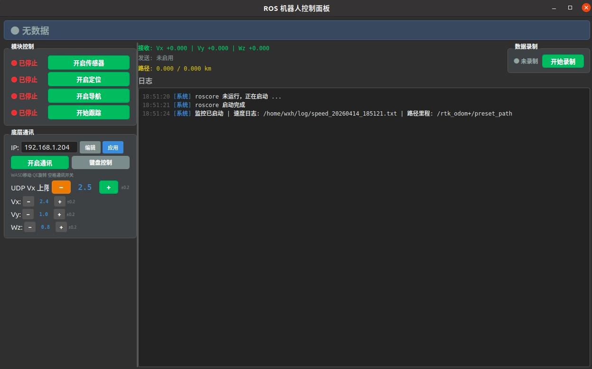
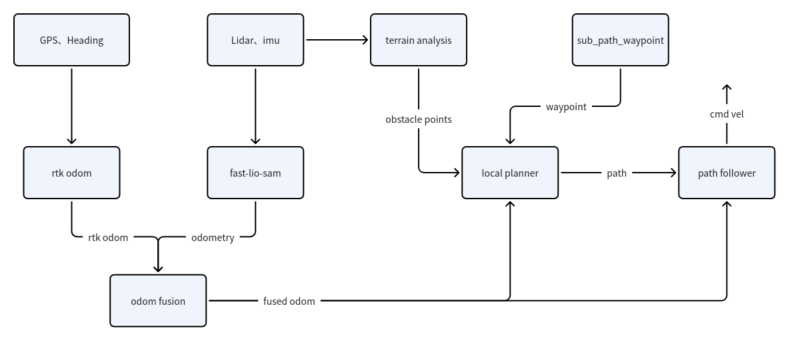

# 灵龙马拉松

## 安装说明

1. ros版本为noetic
2. 依赖
    ```bash 
    sudo apt install libgeographic-dev ros-noetic-octomap-server ros-noetic-map-server ros-noetic-pointcloud-to-laserscan ros-noetic-ros-numpy python3-pip -y
    pip3 install open3d -i https://mirrors.aliyun.com/pypi/simple
    ```
3. 三方库安装
    
    Livox-SDK2
    ```bash
    cd thirdparty/Livox-SDK2
    mkdir build && cd build
    cmake ..
    make -j6
    sudo make install
    ```

    gtsam-develop
    ```bash
    cd thirdparty/gtsam-develop/
    mkdir build && cd build
    cmake -DGTSAM_BUILD_WITH_MARCH_NATIVE=OFF \
        -DGTSAM_USE_SYSTEM_EIGEN=ON \
        -DGTSAM_BUILD_UNSTABLE=ON \
        -DGTSAM_WITH_TBB=OFF ..
    make -j6
    sudo make install
    ```

4. 编译

    首先编译livox_ros_driver2
    ```bash
    cd livox_ros_driver2
    ./build.sh ros1
    ```

    编译过后，回到工作空间下再次编译
    ```bash
    catkin_make
    ```

## 使用说明

代码整体做了统一调度，运行
```bash
python3 robot_control_panel.py
```
整体面板如下


> 每个按键开启后都会变红

1. 左上角是功能启动键，包含
    - 启动传感器：包含启动GPS定位以及激光雷达，输出gps定位信息以及激光雷达信息。gps相关信息会在`无数据`显示处展示，例如会变成固定解、浮点解等
    - 开启定位：启动fast-lio-sam、gps与odom融合节点等，输出融合后的定位
    - 开启导航：启动导航控制程序，输出速度控制指令
    - 开始跟踪：读取gps全局路径，并依次发布目标点给导航端


2. 左下角是与运控通信按钮以及速度控制
    - ip：填写与运控端速度控制通讯的ip，可通过`编辑`按钮进行编辑
    - 开启通讯：表示将相关速度指令通过UDP方式发送到运控端
    - 键盘控制：表示可以通过电脑`QWEASD`控制速度指令的发布，例如Vx当前设置为2.4m/s，那么按住`w`键表示只发送前向速度2.4m/s；Wz为0.8rad/s，那么按住`Q`键表示给向左的角速度0.8rad/s。
    - UDP Vx上限：表示无论键盘控制和导航程序给多大的前向速度，只要大于设置值，就只会发送设置值的速度

3. 右上角是导航输出速度、键盘控制速度输出、行进路程以及部分话题bag包录制

4. 右下角是相关日志


## 算法功能简述及流程图
适用于室外地面机器人（有 LiDAR+IMU，最好有 RTK），可以实现实时定位建图、全局约束抗漂移、局部避障跟踪等功能

**功能简述**

- FAST_LIO_SAM

    场景：LiDAR+IMU 实时定位建图

    功能：LIO 里程计、点云配准建图、输出 /Odometry，作为全链路主定位源
- rtk_odom

    场景：有 GNSS/RTK 和 heading 输入

    功能：把 RTK 数据转成 /rtk_odom 和路径，提供全局高精度约束
- odom_fusion

    场景：RTK 会断、LIO 会漂移

    功能：融合 /rtk_odom + /Odometry，输出更稳的 /fused_odom、/fused_path，带超时检测和恢复平滑
- terrain_analysis / terrain_analysis_ext

    场景：需要可通行性/地形障碍分析
    
    功能：对局部与扩展范围地形进行栅格/高度/障碍表达，给局部规划器使用
- local_planner

    场景：已有候选路径库或局部路径搜索需求

    功能：局部路径选择、路径跟踪、速度与转向约束输出
- sensor_scan_generation

    场景：下游需要传感器系扫描数据

    功能：把配准点云/地图系结果转换成更适合规划的扫描表示


**整体流程如图所示**



## 开源借鉴使用

- [fast-lio-sam](https://github.com/kahowang/FAST_LIO_SAM.git)
- [autonomous_exploration_development_environment](https://github.com/HongbiaoZ/autonomous_exploration_development_environment.git)


